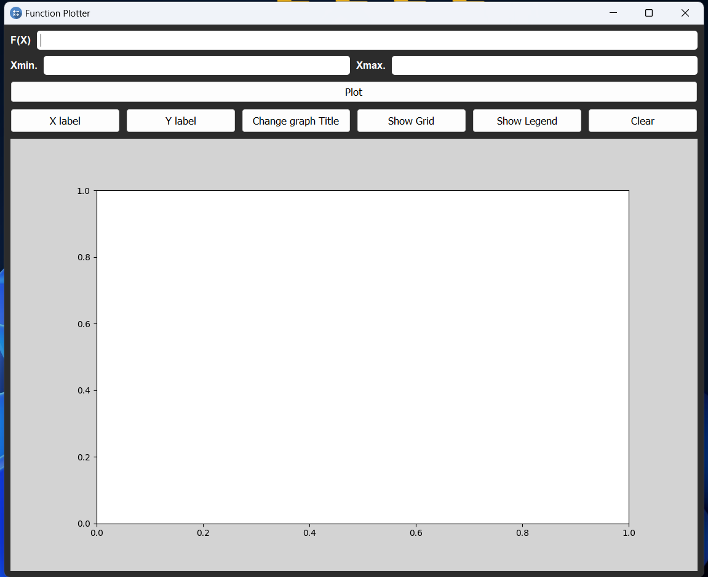
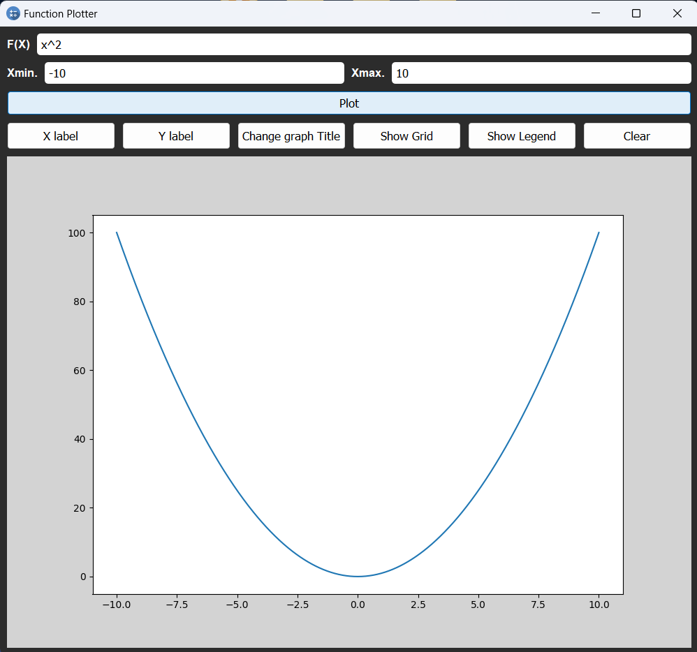
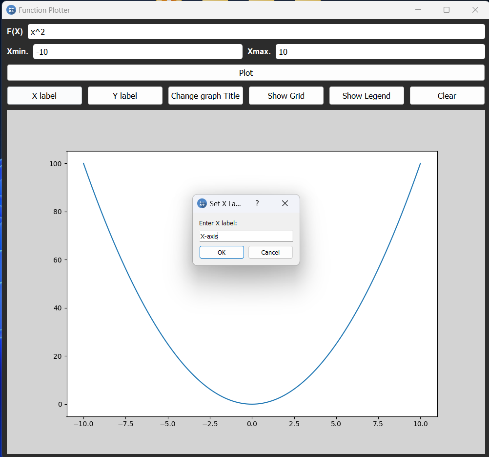
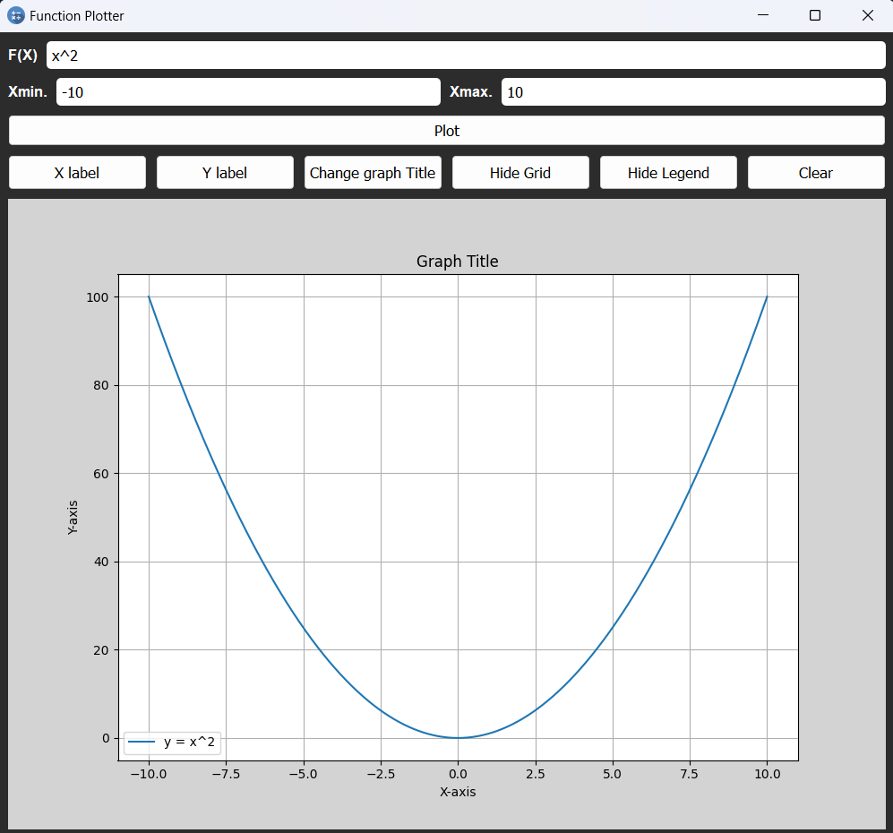
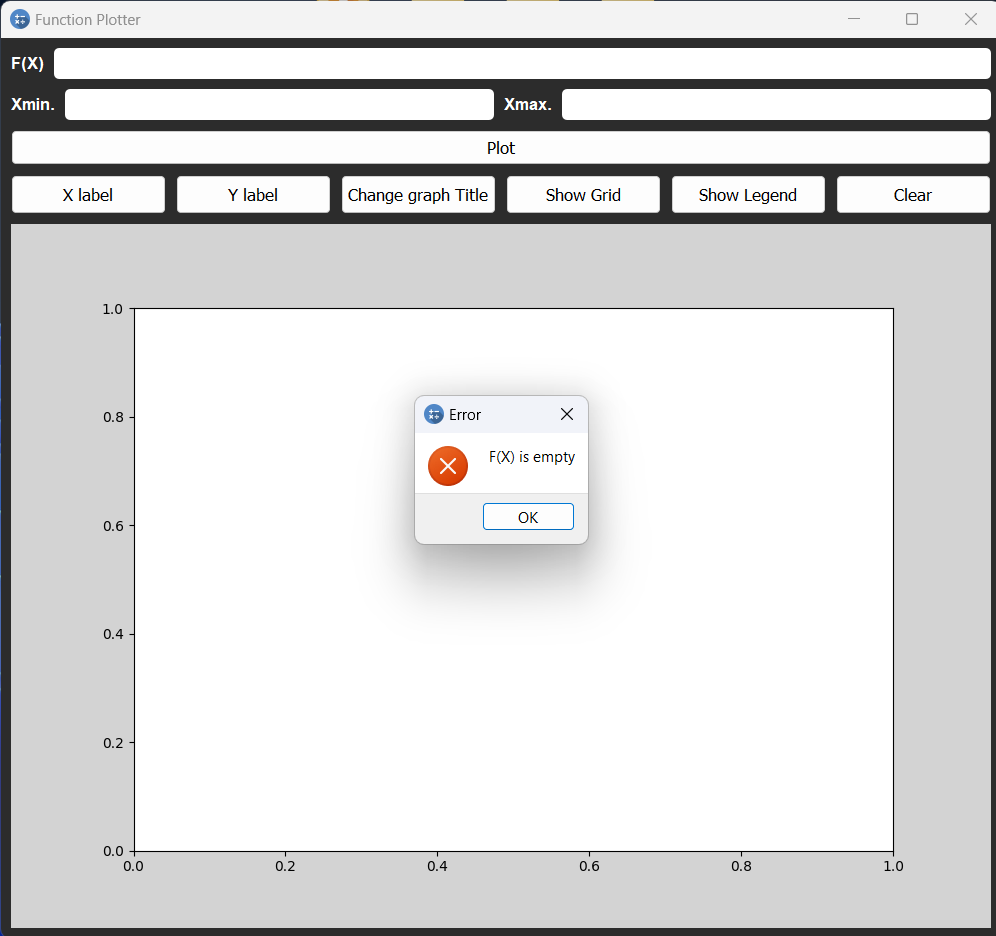
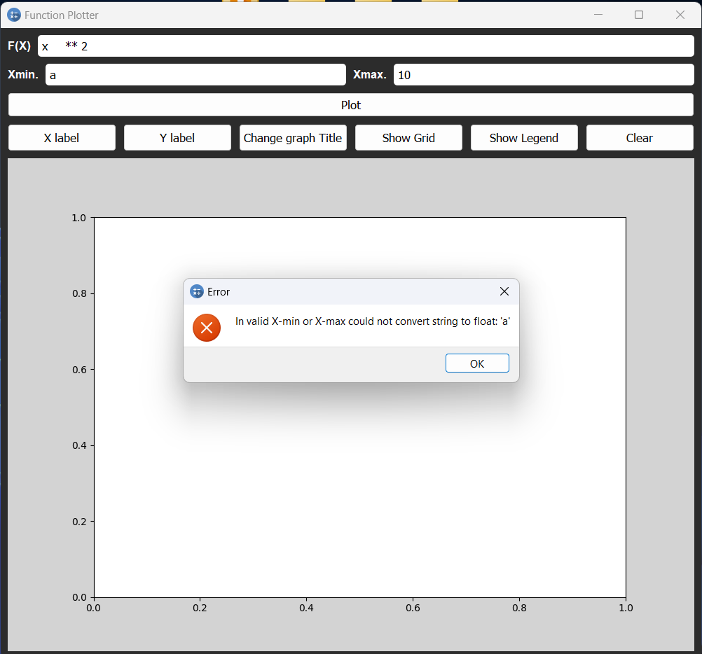
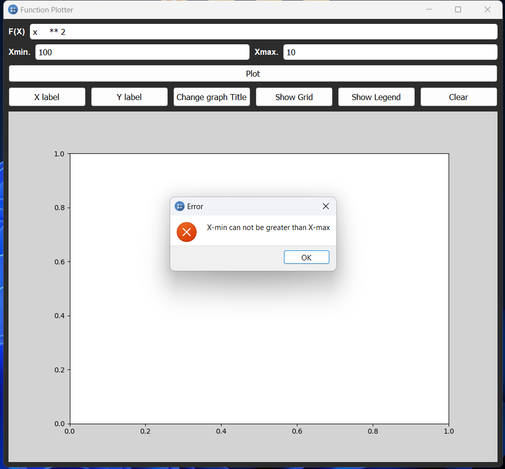
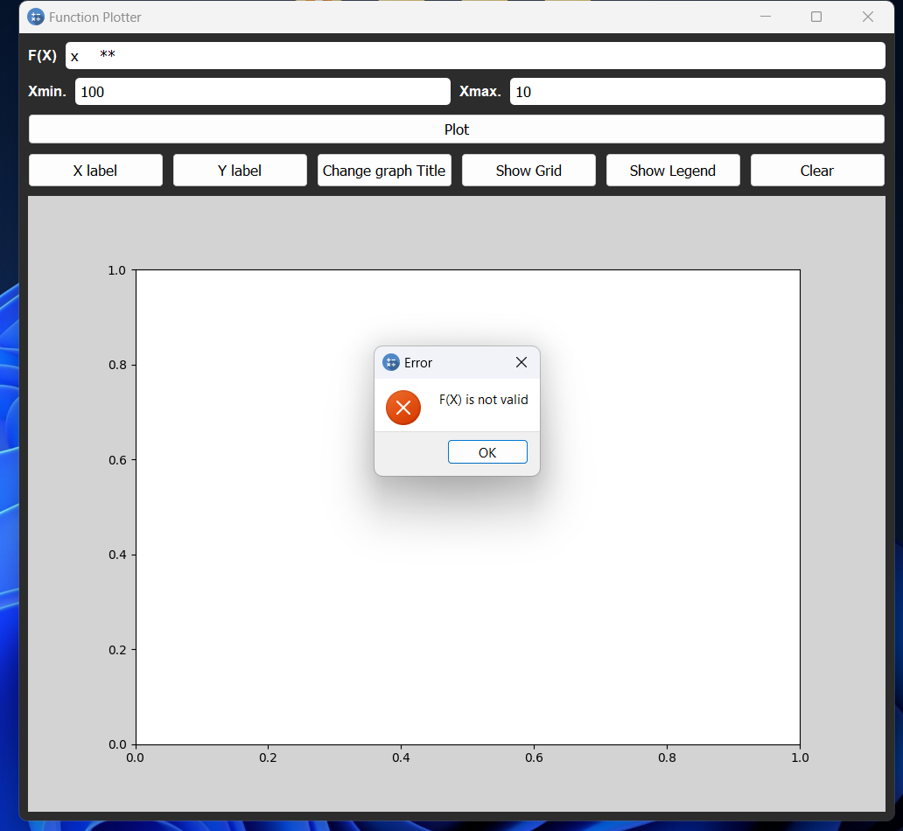

# Function-plotter
The Function Plotter App is a powerful tool that allows users to visualize mathematical functions in a simple and intuitive way. With this app, users can plot various types of functions, explore their behavior, and gain a better understanding of their mathematical properties. Whether you are a student, a teacher, or a math enthusiast, the Function Plotter App is designed to assist you in visualizing functions and making meaningful observations.
## Features
The Function Plotter App offers several key features to enhance your experience:

- **Function Input:** The app allows users to enter mathematical functions using standard notation. You can input a wide range of functions, including polynomial functions, trigonometric functions, exponential functions, logarithmic functions, and more.

- **Graphical Visualization:** Once you input a function, the app generates a graphical representation of the function.

- **Customizable Parameters:** The app allows users to customize various parameters to modify the appearance of the graph. You can adjust the range of x and y-axis and add gridlines for better visualization.

- **Multiple Functions:** The Function Plotter App supports plotting multiple functions simultaneously. This feature enables users to compare different functions, observe their interactions, and analyze their relationships.

## Dependencies
- You must check that Python version is 3.7.0

    ```
    python --version
    ```

- Install External Packages and Libraries

    ```
    pip install matplotlib==3.5.3 mpmath==1.3.0 numpy==1.21.6 packaging==23.1 Pillow==9.5.0 pytest==7.4.0 pytest-qt==4.2.0 python-dateutil==2.8.2 PySide2==5.15.2.1 shiboken2==5.15.2.1 sympy==1.10.1
    ```


## How to Use
Using the Function Plotter App is straightforward and user-friendly. Here's a step-by-step guide to get started:

- **Open the App:** Launch the Function Plotter App on your device. --> `python .\main.py`

- **Enter the Function:** Locate the input field or text box provided by the app to enter your desired function. Ensure you input the function correctly using standard mathematical notation.

- **Plot the Function:** Once you have entered the function, click the "plot" button to generate the plot. The app will process the function and display the corresponding graph on the screen.

- **Customize the Plot:** If desired, you can customize the appearance of the plot using the app's settings. Adjust the x and y-axis ranges, and add gridlines to improve visibility. These customization options may vary depending on the specific features provided by the app.

## Photos

<center>
    <figure class="image" style="text-align: center;">
        <figcaption>
                <b>The main interface of the Function Plotter App</b>
        </figcaption>
        
    </figure>
    <figure class="image"  style="text-align: center;">
        <figcaption>
                <b>Showing the input field for entering a mathematical function, an example of a plotted graph for a cubic function.</b>
        </figcaption>
        
    </figure>
    <figure class="image" style="text-align: center;">
        <figcaption>
                <b>Customization options for the plot, allowing users to adjust axis labels and graph titles.
                </b>
        </figcaption>
        
    </figure>
    <figure class="image" style="text-align: center;">
        <figcaption>
                <b>Show Grid-lines and legend</b>
        </figcaption>
        
    </figure>
    <figure class="image"  style="text-align: center;">
        <figcaption>
                <b>F(x) is empty</b>
        </figcaption>
        
    </figure>
    <figure class="image"  style="text-align: center;">
        <figcaption>
                <b>Invalid X-min</b>
        </figcaption>
        
    </figure>
    <figure class="image">
        <figcaption>
                <b>X-min can not be greater than X-max</b>
        </figcaption>
        
    </figure>
    <figure class="image">
        <figcaption>
                <b>function is not valid</b>
        </figcaption>
        
    </figure>
</center>

## Video
### For illustration

https://github.com/Abodawoud/Function-plotter/assets/109487123/b1498dd2-92e5-41e6-93b6-5b297439105d


## Project Structure
```
Function-Plotter
├── main.py
├── test
    ├── ..
    ├── test_helper_functions.py
    ├── test_layout.py
├── container
    ├── ..
    ├── layout.py
├── components
    ├── ..
    ├── btns.py
    ├── inputs.py
    ├── labels.py
    ├── exceptions.py
    ├── helper_functions.py
```

## Tests
To run tests for the app, navigate to the `test` folder and execute the following command
```
pytest
```
This command will initiate the execution of all the tests located in the `./test` directory. 

## Acknowledgement
. MasterMicro (provide guidlines)

## Author
The Function Plotter App was created by Yousef Abodawoud.

Feel free to reach out if you have any questions or feedback.
